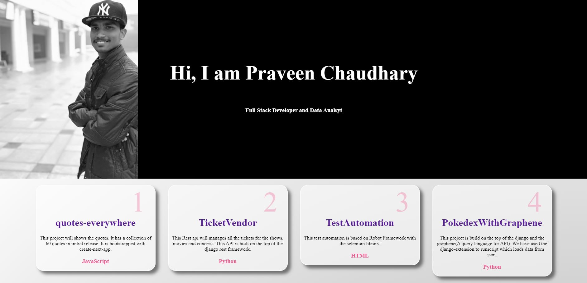
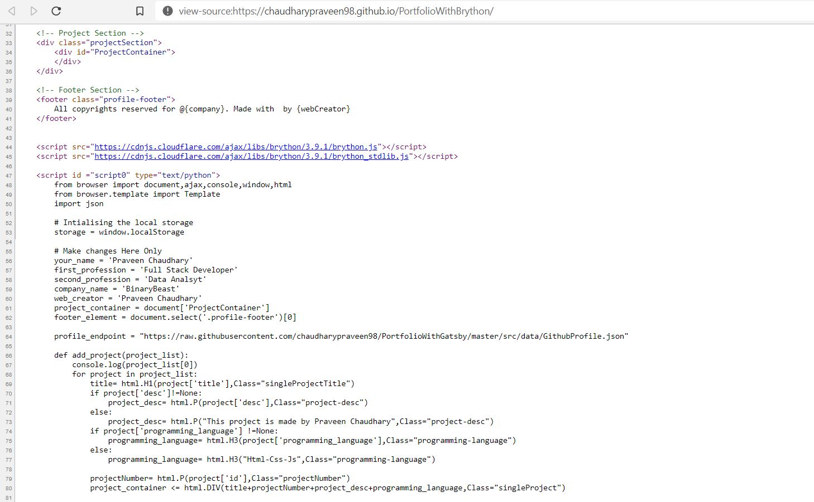

## Portfolio With Brython ( Web Assembly )
This project tries the implement the basic web assembly toolbar to build portfolio page with python.

#### Features : -
1. Great UI
2. Uses variable to maniplate the dom
3. Clean code.

#### Web Preview : -

#### Page Source : - 

It contains the python in the page source code.

## Brython Basic Usage
[Brython.html](brython.html) implement the basic web assembly tool which enables us to write and execute the python code in the web browser. We can make ajax calls, manipulate the dom, use variable and much more.

#### Features Implemented : -
1. Alert
2. Variable
3. Template
4. Ajax calls
5. Event binding
6. File Reader